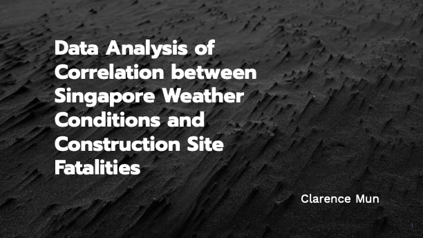

# Project 1: Data Analysis of Correlation between Singapore Weather and Construction Site Fatalities

### Goals

Heat is a notable challenge for construction workers and may be worsening with global warming.

This research aims to analyse weather and fatalities data to identify the correlation between weather conditions and deaths among construction workers.

### Dataset

**To-Do:** *Edit the table below to create your own data dictionary for the datasets you chose.*

|Feature|Type|Dataset|Description|
|---|---|---|---|
|Year-Month|datetime64[ns]|All|The month and year for the recorded data, formatted as YYYY-MM-DD.|
|Fatalities|int64|construction_workplace_fatalities_2021_to_2023|The number of construction fatalities recorded.|
|maximum_rainfall_in_a_day|float64|rainfall-monthly-highest-daily-total|The maximum rainfall recorded in a single day, in millimeters.|
|no_of_rainy_days|int64|rainfall-monthly-number-of-rain-days|The number of days with rainfall.|
|total_rainfall|float|rainfall-monthly-total|Total rainfall in mm|
|rh_extremes_minimum|int64|relative-humidity-monthly-mean|The minimum recorded extreme relative humidity, in percentage.|
|mean_sunshine_hrs|float64|sunshine-duration-monthly-mean-daily-duration|The average number of sunshine hours per day.|
|mean_temp|float64|surface-air-temperature-monthly-mean|The average temperature during the period, in degrees Celsius.|

The dataset can be found [here](../data/)

    
### Results

The summary focuses on the correlation between the number of rainy days and total rainfall, along with additional observations on mean temperature and fatalities in the construction industry:

- **Mean Temperature and Fatalities**: There's a slight positive correlation between mean temperature and fatalities in the construction industry, suggesting that higher temperatures may marginally increase the risk of fatalities. However, the correlation is not strong, indicating that extreme heat is not a major cause of fatalities but highlights the importance of heat safety measures.

- **Total Rainfall and Fatalities**: A mild negative correlation is observed, suggesting that higher rainfall amounts might lead to fewer fatalities in the construction industry, possibly due to reduced activity during heavy rain. The weak correlation and data variability suggest that rainfall is not a direct predictor of fatalities, similar to temperature.

These findings highlight the complex relationships between environmental factors and their impacts, emphasizing the importance of considering multiple variables when assessing conditions such as construction site safety.